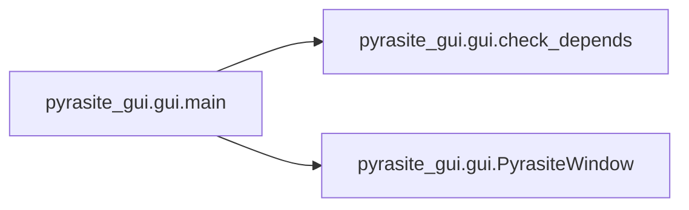

# Pyrasite Gui Gui

[_Documentation generated by Documatic_](https://www.documatic.com)

<!---Documatic-section-Codebase Structure-start--->
## Codebase Structure

<!---Documatic-block-system_architecture-start--->
```mermaid
None
```
<!---Documatic-block-system_architecture-end--->

# #
<!---Documatic-section-Codebase Structure-end--->

<!---Documatic-section-pyrasite_gui.gui.get_color-start--->
## pyrasite_gui.gui.get_color

<!---Documatic-section-get_color-start--->
### Summary

Get a random color from the tango table.

<!---Documatic-block-pyrasite_gui.gui.get_color-start--->
<details>
	<summary><code>pyrasite_gui.gui.get_color</code> code snippet</summary>

```python
def get_color():
    tango = ['c4a000', 'ce5c00', '8f5902', '4e9a06', '204a87', '5c3566', 'a40000', '555753']
    used = thread_colors.values()
    for color in tango:
        if color not in used:
            return color
    return ''.join([hex(randrange(0, 255))[2:] for i in range(3)])
```
</details>
<!---Documatic-block-pyrasite_gui.gui.get_color-end--->
<!---Documatic-section-get_color-end--->

# #
<!---Documatic-section-pyrasite_gui.gui.get_color-end--->

<!---Documatic-section-pyrasite_gui.gui.humanize_bytes-start--->
## pyrasite_gui.gui.humanize_bytes

<!---Documatic-section-humanize_bytes-start--->
### Summary

Return a human - readable string describing the given number of bytes.

<!---Documatic-block-pyrasite_gui.gui.humanize_bytes-start--->
<details>
	<summary><code>pyrasite_gui.gui.humanize_bytes</code> code snippet</summary>

```python
def humanize_bytes(bytes, precision=1):
    abbrevs = ((1 << 50, 'PB'), (1 << 40, 'TB'), (1 << 30, 'GB'), (1 << 20, 'MB'), (1 << 10, 'kB'), (1, 'bytes'))
    if bytes == 1:
        return '1 byte'
    for (factor, suffix) in abbrevs:
        if bytes >= factor:
            break
    return '%.*f %s' % (precision, bytes / factor, suffix)
```
</details>
<!---Documatic-block-pyrasite_gui.gui.humanize_bytes-end--->
<!---Documatic-section-humanize_bytes-end--->

# #
<!---Documatic-section-pyrasite_gui.gui.humanize_bytes-end--->

<!---Documatic-section-pyrasite_gui.gui.setup_logger-start--->
## pyrasite_gui.gui.setup_logger

<!---Documatic-section-setup_logger-start--->
### Summary

Setup logger for pyrasite.

<!---Documatic-block-pyrasite_gui.gui.setup_logger-start--->
<details>
	<summary><code>pyrasite_gui.gui.setup_logger</code> code snippet</summary>

```python
def setup_logger(verbose=False):
    try:
        NullHandler = logging.NullHandler
    except AttributeError:

        class NullHandler(logging.Handler):

            def emit(self, record):
                pass
    log = logging.getLogger('pyrasite')
    log.addHandler(NullHandler())
    level = logging.INFO
    if verbose:
        level = logging.DEBUG
    handler = logging.StreamHandler()
    handler.setFormatter(logging.Formatter('%(message)s'))
    handler.setLevel(level)
    log.addHandler(handler)
    log.setLevel(level)
    return log
```
</details>
<!---Documatic-block-pyrasite_gui.gui.setup_logger-end--->
<!---Documatic-section-setup_logger-end--->

# #
<!---Documatic-section-pyrasite_gui.gui.setup_logger-end--->

<!---Documatic-section-pyrasite_gui.gui.check_depends-start--->
## pyrasite_gui.gui.check_depends

<!---Documatic-section-check_depends-start--->
### Summary

Check if the graphviz dot command is available.

<!---Documatic-block-pyrasite_gui.gui.check_depends-start--->
<details>
	<summary><code>pyrasite_gui.gui.check_depends</code> code snippet</summary>

```python
def check_depends():
    try:
        subprocess.call(['dot', '/dev/null'], shell=False)
    except OSError:
        print('WARNING: graphviz dot command not found. ' + 'Call graph will not be available')
```
</details>
<!---Documatic-block-pyrasite_gui.gui.check_depends-end--->
<!---Documatic-section-check_depends-end--->

# #
<!---Documatic-section-pyrasite_gui.gui.check_depends-end--->

<!---Documatic-section-pyrasite_gui.gui.main-start--->
## pyrasite_gui.gui.main

<!---Documatic-section-main-start--->


### Summary

Main entry point for Pyrasite.

### Object Calls

* pyrasite_gui.gui.check_depends
* pyrasite_gui.gui.PyrasiteWindow

<!---Documatic-block-pyrasite_gui.gui.main-start--->
<details>
	<summary><code>pyrasite_gui.gui.main</code> code snippet</summary>

```python
def main():
    check_depends()
    GObject.threads_init()
    mainloop = GLib.MainLoop()
    window = PyrasiteWindow()
    window.show()

    def quit(widget, event, mainloop):
        window.close()
        mainloop.quit()
    window.connect('delete-event', quit, mainloop)
    try:
        mainloop.run()
    except KeyboardInterrupt:
        window.close()
        mainloop.quit()
```
</details>
<!---Documatic-block-pyrasite_gui.gui.main-end--->
<!---Documatic-section-main-end--->

# #
<!---Documatic-section-pyrasite_gui.gui.main-end--->

[_Documentation generated by Documatic_](https://www.documatic.com)